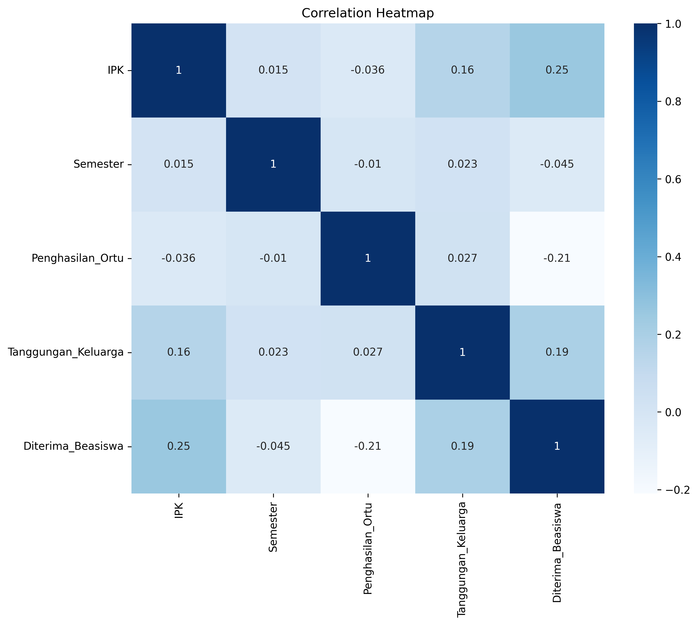
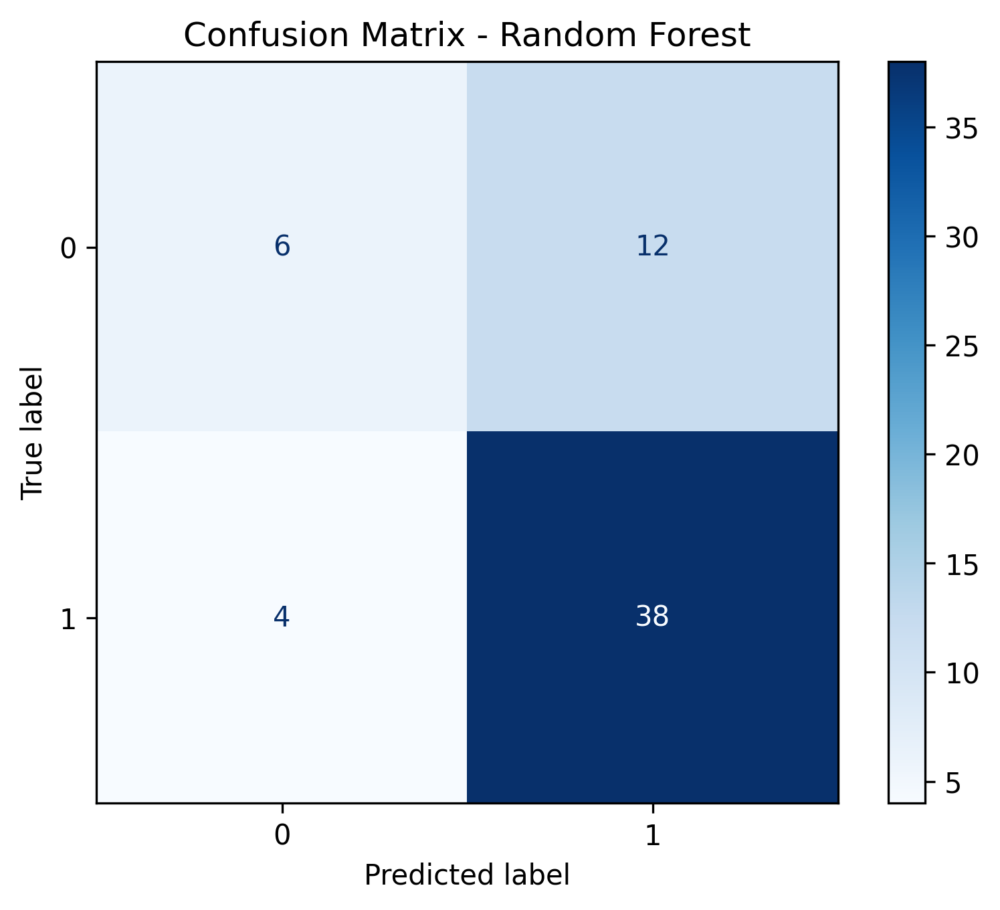
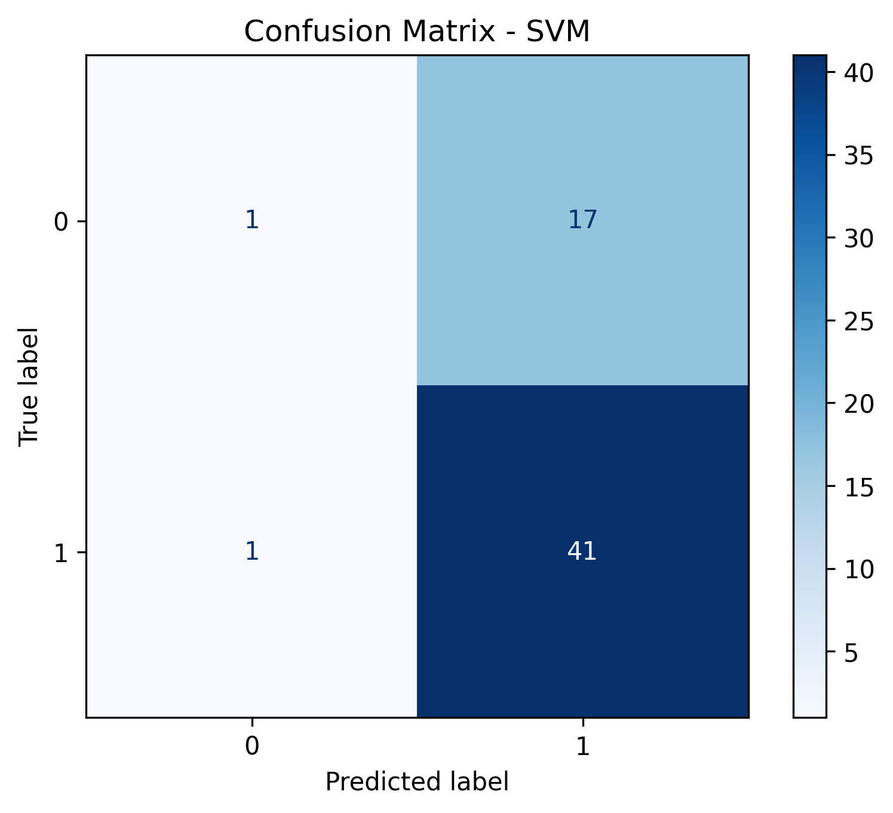
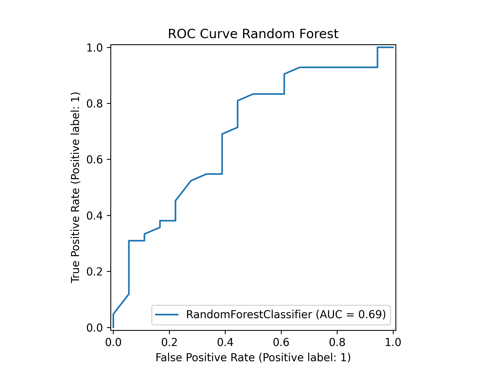
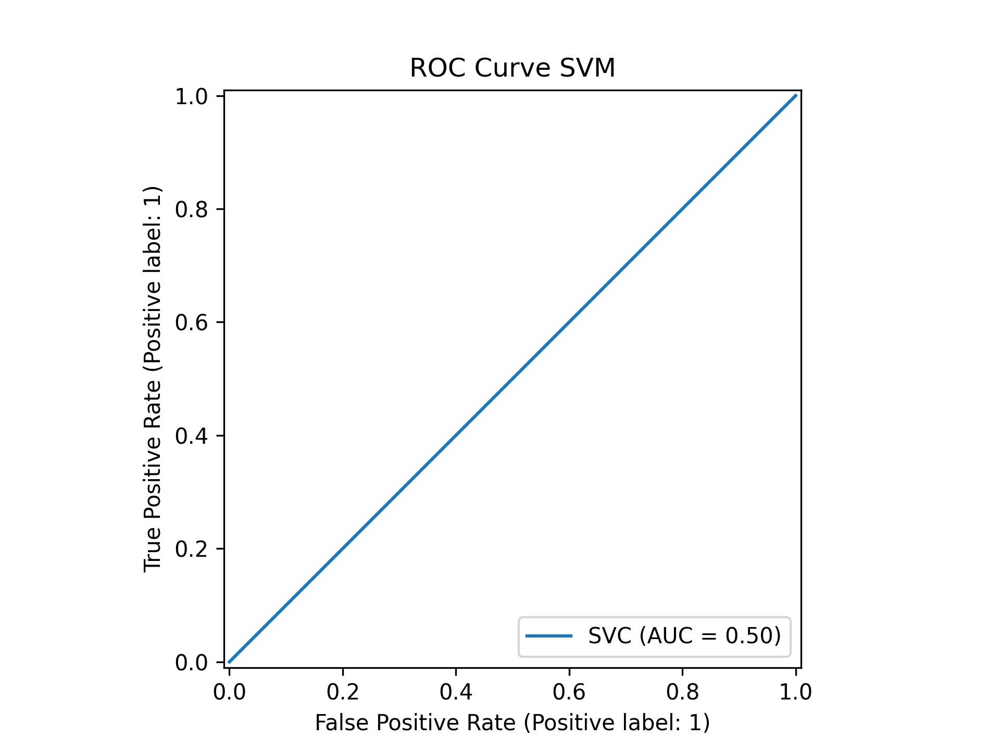

## Scholarship Eligibility Prediction using Machine Learning

## Deskripsi Proyek

Proyek ini bertujuan untuk membangun model Machine Learning yang dapat memprediksi apakah seorang mahasiswa layak menerima beasiswa berdasarkan data akademik dan kondisi sosial ekonomi.

Penelitian ini merupakan implementasi tahapan Machine Learning mulai dari data preprocessing, pemodelan, evaluasi, hingga deployment sederhana sebagai bagian dari Proyek Akhir Mata Kuliah Pembelajaran Mesin.

---

## Latar Belakang

Proses seleksi penerima beasiswa umumnya masih dilakukan secara manual sehingga membutuhkan waktu yang lama dan berpotensi menimbulkan subjektivitas dalam pengambilan keputusan.

Melalui pendekatan Machine Learning, proses seleksi diharapkan dapat dilakukan secara lebih cepat, objektif, dan konsisten berdasarkan pola dari data historis mahasiswa.

---

## Rumusan Masalah

- Bagaimana membangun model Machine Learning untuk mengklasifikasikan kelayakan penerima beasiswa?
- Algoritma manakah yang memberikan performa terbaik dalam memprediksi kelayakan penerima beasiswa?

---

## Tujuan Penelitian

- Membangun model klasifikasi penerima beasiswa menggunakan Machine Learning.
- Membandingkan performa algoritma Random Forest dan Support Vector Machine (SVM).
- Menentukan model terbaik berdasarkan hasil evaluasi.

---

## Dataset

Dataset yang digunakan merupakan **Dataset Seleksi Beasiswa** yang diperoleh dari Kaggle.

Dataset terdiri dari 300 data mahasiswa dengan beberapa atribut berikut.

### Feature

- IPK
- Semester
- Penghasilan Orang Tua
- Tanggungan Keluarga
- Prestasi
- Aktif Organisasi
- Status Rumah
- Jenis Kelamin

### Target

- Diterima Beasiswa
  - Ya
  - Tidak

---

## Metodologi

Penelitian mengikuti tahapan Machine Learning sebagai berikut.

- Data Understanding
- Data Preprocessing
- Feature Engineering
- Data Splitting
- Model Training
- Model Evaluation
- Deployment

---

## Algoritma

- Random Forest
- Support Vector Machine (SVM)

---

## Tahapan Machine Learning

- Data Cleaning
- Missing Value Handling
- Encoding Data
- Feature Scaling
- Train-Test Split
- Hyperparameter Tuning
- Cross Validation
- Model Evaluation
- Deployment

---

## Evaluasi Model

Metrik evaluasi yang digunakan:

- Accuracy
- Precision
- Recall
- F1-Score
- Confusion Matrix
- ROC Curve
- ROC-AUC

---

## Struktur Repository

```
uas-ml/
│
├── dataset/
├── notebook/
├── images/
├── models/
├── report/
├── README.md
└── requirements.txt
```

---

## Cara Menjalankan

Clone repository.

```bash
git clone https://github.com/rfpmaa/uas-ml.git
```

Install library.

```bash
pip install -r requirements.txt
```

Buka notebook pada folder **notebook/**.

Jalankan seluruh cell secara berurutan.

---

## Hasil

Folder `images/` berisi visualisasi hasil eksperimen.

### Correlation Heatmap


### Confusion Matrix Random Forest



### Confusion Matrix SVM



### ROC Curve Random Forest



### ROC Curve SVM




---

## Kesimpulan

Model Machine Learning akan dibandingkan berdasarkan hasil evaluasi menggunakan Accuracy, Precision, Recall, dan F1-Score untuk menentukan algoritma terbaik dalam mengklasifikasikan kelayakan penerima beasiswa.

---

## Penulis

**Rafania Putri Mahendra**

Universitas Dian Nuswantoro

Mata Kuliah Pembelajaran Mesin
