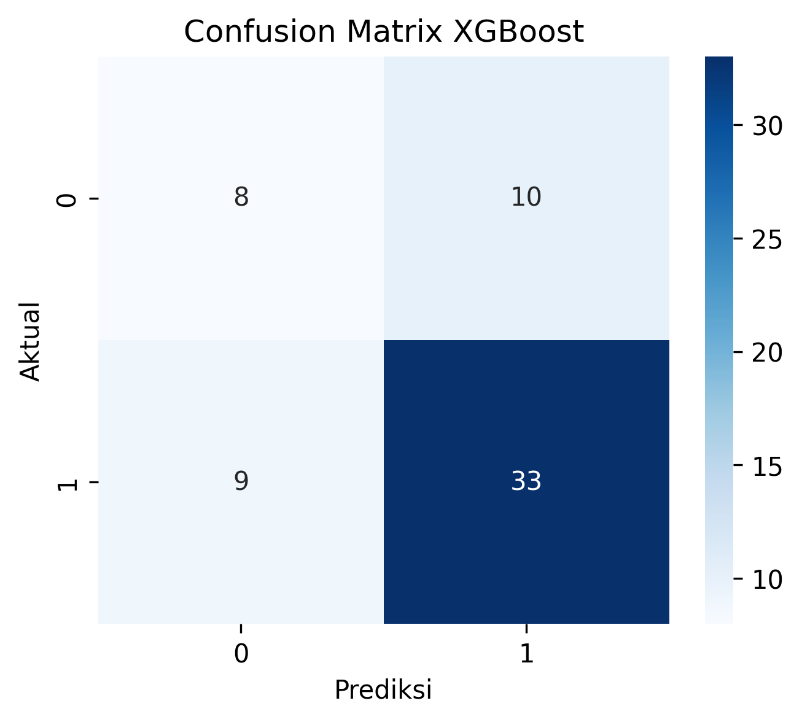
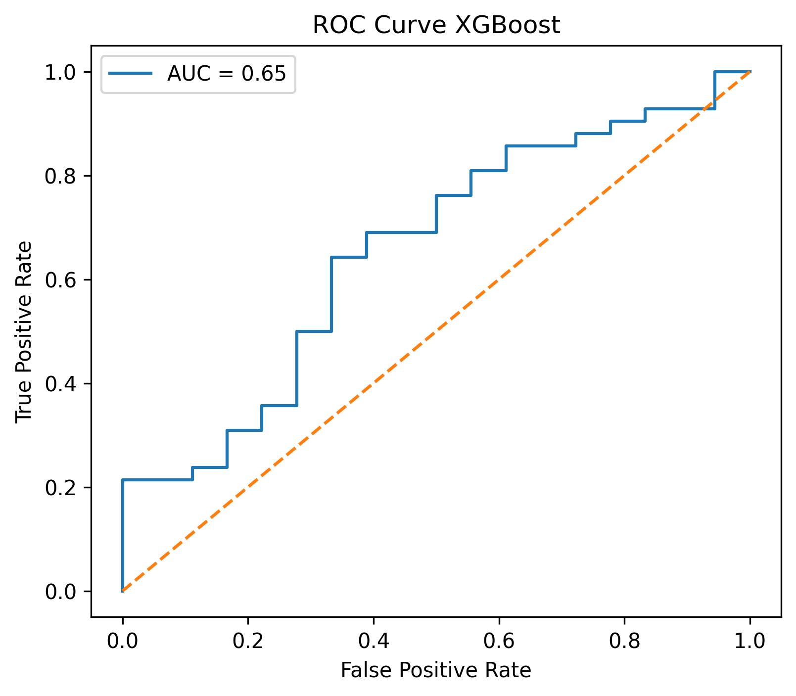
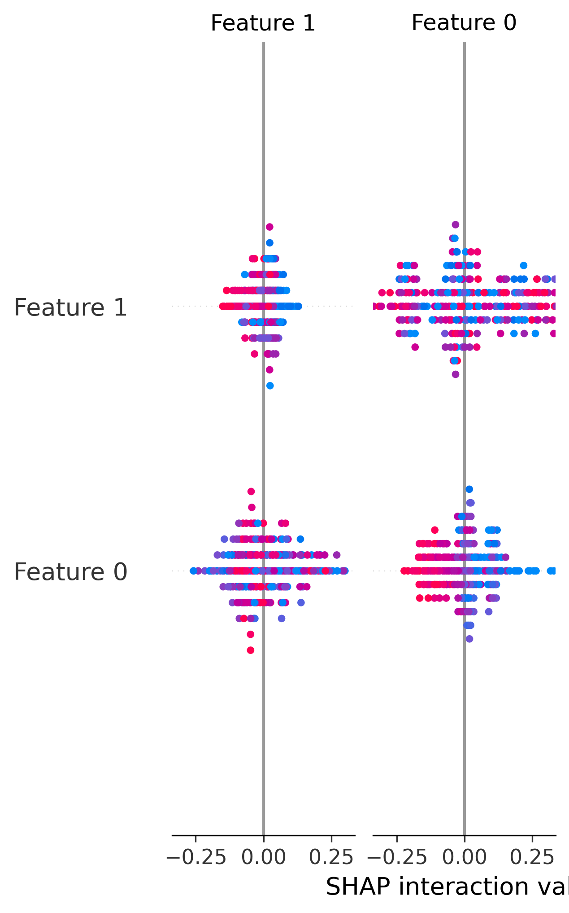

# Scholarship Eligibility Prediction using Machine Learning

## Deskripsi Proyek

Proyek ini bertujuan untuk membangun model Machine Learning yang dapat memprediksi kelayakan penerima beasiswa berdasarkan data akademik dan kondisi sosial ekonomi mahasiswa. Model dikembangkan menggunakan algoritma Random Forest, Support Vector Machine (SVM), dan Extreme Gradient Boosting (XGBoost), kemudian dibandingkan untuk memperoleh algoritma dengan performa terbaik. Penelitian ini juga mengimplementasikan model terbaik ke dalam aplikasi berbasis Streamlit sehingga dapat digunakan sebagai sistem pendukung keputusan dalam proses seleksi penerima beasiswa.

---

## Latar Belakang

Proses seleksi penerima beasiswa umumnya masih dilakukan secara manual sehingga membutuhkan waktu yang lama dan berpotensi menimbulkan subjektivitas dalam pengambilan keputusan. Melalui pendekatan Machine Learning, proses seleksi diharapkan dapat dilakukan secara lebih cepat, objektif, dan konsisten berdasarkan pola dari data historis mahasiswa. Selain itu, metode SHAP digunakan untuk menginterpretasikan hasil prediksi sehingga keputusan yang dihasilkan model menjadi lebih transparan dan mudah dipahami.

---

## Rumusan Masalah

- Bagaimana membangun model Machine Learning untuk memprediksi kelayakan penerima beasiswa?
- Bagaimana performa algoritma Random Forest, Support Vector Machine (SVM), dan XGBoost dalam melakukan klasifikasi penerima beasiswa?
- Algoritma manakah yang memberikan performa terbaik berdasarkan hasil evaluasi?

---

## Tujuan Penelitian

- Membangun model Machine Learning untuk memprediksi kelayakan penerima beasiswa.
- Membandingkan performa algoritma Random Forest, Support Vector Machine (SVM), dan XGBoost.
- Menentukan algoritma terbaik berdasarkan hasil evaluasi serta menginterpretasikan hasil prediksi menggunakan SHAP.

---

## Dataset

Dataset yang digunakan merupakan **Dataset Seleksi Beasiswa** yang diperoleh dari Kaggle.

Dataset terdiri dari **300 data mahasiswa** dengan **8 atribut** dan **1 atribut target**.

### Feature

- IPK
- Semester
- Penghasilan Orang Tua
- Tanggungan Keluarga
- Prestasi
- Aktif Organisasi
- Status Rumah
- Jenis Kelamin

### Target

- Diterima Beasiswa
  - Ya
  - Tidak

---

## Metodologi

Penelitian menggunakan metodologi **CRISP-DM (Cross Industry Standard Process for Data Mining)** yang terdiri atas:

- Business Understanding
- Data Understanding
- Data Preparation
- Modeling
- Evaluation
- Deployment

---

## Algoritma

- Random Forest
- Support Vector Machine (SVM)
- Extreme Gradient Boosting (XGBoost)

---

## Library yang Digunakan

- Pandas
- NumPy
- Matplotlib
- Seaborn
- Plotly
- Scikit-learn
- XGBoost
- SHAP
- Streamlit
- Joblib

---

## Evaluasi Model

Model dievaluasi menggunakan metrik Accuracy, Precision, Recall, F1-Score, Confusion Matrix, dan ROC Curve.

| Model | Accuracy |
|--------|----------|
| Random Forest | **73.33%** |
| Support Vector Machine (SVM) | **70.00%** |
| XGBoost | **68.33%** |

Berdasarkan hasil evaluasi, algoritma **Random Forest** memberikan performa terbaik sehingga dipilih sebagai model utama pada aplikasi prediksi kelayakan penerima beasiswa.

---

## Struktur Repository

```text
uas-ml/
│
├── app.py
├── README.md
├── requirements.txt
│
├── dataset/
├── notebook/
├── images/
└── laporan/
```

---

## Cara Menjalankan

Clone repository.

```bash
git clone https://github.com/rfpmaa/uas-ml.git
```

Masuk ke folder project.

```bash
cd uas-ml
```

Install seluruh library.

```bash
pip install -r requirements.txt
```

Jalankan aplikasi Streamlit.

```bash
streamlit run app.py
```

---

# Hasil

<h3>Correlation Heatmap</h3>

<p align="center">
  
</p>

---

<h3>Confusion Matrix</h3>

<table>
<tr>

<td align="center">
<b>Random Forest</b><br>

</td>

<td align="center">
<b>Support Vector Machine (SVM)</b><br>

</td>

<td align="center">
<b>XGBoost</b><br>

</td>

</tr>
</table>

---

<h3>ROC Curve</h3>

<table>
<tr>

<td align="center">
<b>Random Forest</b><br>

</td>

<td align="center">
<b>Support Vector Machine (SVM)</b><br>

</td>

<td align="center">
<b>XGBoost</b><br>

</td>

</tr>
</table>

---

<h3>SHAP Summary Plot</h3>

<p align="center">
  
</p>

---

# Tampilan Aplikasi Streamlit

<table>
<tr>

<td align="center">
<b>Dashboard EDA</b><br>

</td>

<td align="center">
<b>Model Demo</b><br>

</td>

</tr>

<tr>

<td align="center">
<b>Evaluasi Model</b><br>

</td>

<td align="center">
<b>Interpretasi Hasil</b><br>

</td>

</tr>

<tr>
<td colspan="2" align="center">
<b>Dokumentasi</b><br>

</td>
</tr>

</table>

---

## Deployment

**GitHub Repository**

https://github.com/rfpmaa/uas-ml

**Streamlit**

*(Tambahkan link deployment Streamlit di sini.)*

**YouTube Presentation**

*(Tambahkan link presentasi YouTube di sini.)*

---

## Penulis

**Rafania Putri Mahendra**

Program Studi Teknik Informatika  
Fakultas Ilmu Komputer  
Universitas Dian Nuswantoro  

Mata Kuliah Pembelajaran Mesin
